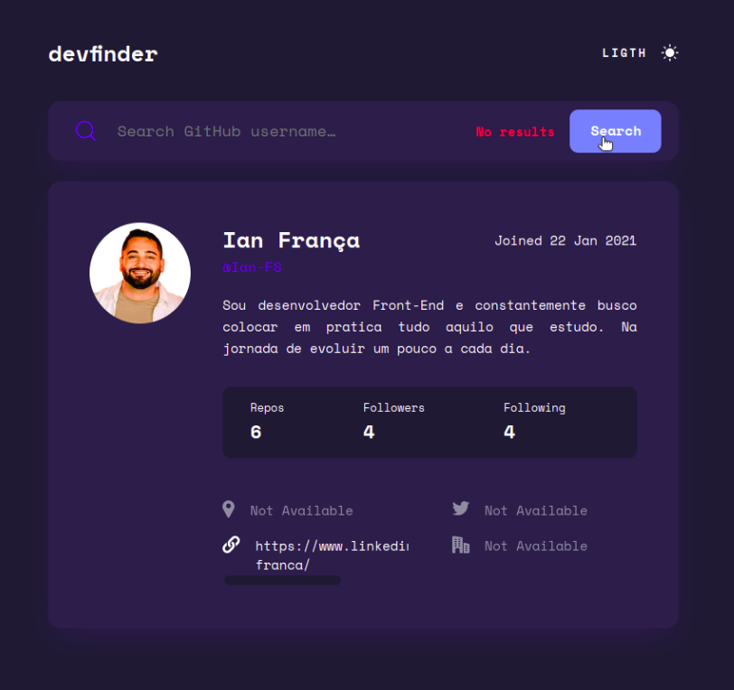

## Índice

- [Visão geral](#visão-geral)
  - [Desafio](#desafio)
  - [Imagens](#imagens)
  - [Links](#links)
- [Meu Processo](#meu-processo)
  - [Construído com](#construído-com)
  - [O que eu aprendi](#o-que-eu-aprendi)
  - [Em futuros projetos](#em-futuros-projetos)
- [Autor](#autor)

## Visão geral

### Desafio

O desafio aqui foi criar uma aplicação de pesquisa de usuários do GitHub utilizando [API de usuários do GitHub](https://docs.github.com/en/rest/reference/users#get-a-user) que possui funcionalidades como:

- Layout ideal(responsivo) para a aplicação, de acordo com o tamanho da tela do dispositivo
- Estados de foco para todos os elementos interativos na página
- Pesquisa de usuários do GitHub pelo nome de usuário
- Visualização de informações relevantes do usuário com base em sua pesquisa
- Posibilidade de alternar entre temas claro e escuro
- Ajustar automaticamente o tema de cor com base na preferência escolhida pelo usuario para o dispositivo utilizado.

### Imagens

### Links
https://buscadordeusuarios-github.vercel.app/

## Meu processo

### Construído com

- Marcação HTML5
  - Utilização de elementos de marcação como: div, button, main, header, img, body, head, link, svg. 
- Propriedades CSS
  - Styling
    - Font-Family, Font-Size, Font-Weight, Text-Align, Color, Background-Color, Line-Height, Padding, Margin, Border-Radius e Border
  - CSS Layout
    - Flexbox
    - CSS Gride
  - Media Queries
    - @import
    - @media
  - Pseudo elementos como: hover, active, webkit-scrollbar e placeholder.
- Javascript
  - Manipução DOM(Document Object Model)
    - Seletores
      - QuerySelector
      - GetElementById
    - Escutador de Evento
      - EventListener
    - Propriedades de instancia como: Children, ClassList, Style e InnerHTML
    - Metodo de instancia como: Remove e Add
    - Evento: KeyPress, Click e Error 
- API fetch pra se comunicar com o endpoint da Api do github
  - Fetch
  - Método Then para retornar uma promisse para dar prosseguimento no tratamento da resposta recebida.
  - Throw utilizado pra lançar uma exceção no caso aqui um Error.
  - Catch
    -Utilizado pra tratar erros

### O que eu aprendi e pratiquei

Nesse projeto além de de praticar a utilização da API Fecth pra fazer requisições à uma API externa, aprendi também a utilizar o metodo catch para tratamento de erros durante as requisições e retornar de forma legível e simples ao usuario da aplicação.

Pratiquei pripriedades no CSS que juntas mantem a aplicação responsiva, como: Display flex, media query e unidades de media Rem, e %.

Aprendi a utilizar --prefers-color-scheme-- que detecta a preferencia de temas de cores claras ou escuras feitas pelo usuario em seu device.

Aprendi a utilizar a propriedade de instancia classList e seu metodo add e remove para a alteração dinamica de estilos durante a mudança de tema de cores.

Aprendi a manipular arquivos SVG alterando suas propriedades como cor e endereço para alteração dinamica na mudança de temas de cores

Aprendi a manipular o objeto Date e seus metodos: getDate, getMonth e getFullYear.

### Em futuros projetos

Em futuros projetos pretendo continuar a praticar o que ja aprendi para consolidar esses conhecimentos e ao mesmo tempo aprender outras novas funcionalidade como forma de me desafiar.

## Autor

- Website - [Vercel](https://vercel.com/dashboard)
- Linkedin - [@Ian França](https://www.linkedin.com/in/ian-franca/)
- GitHub - [Ian-FS](https://github.com/Ian-FS)